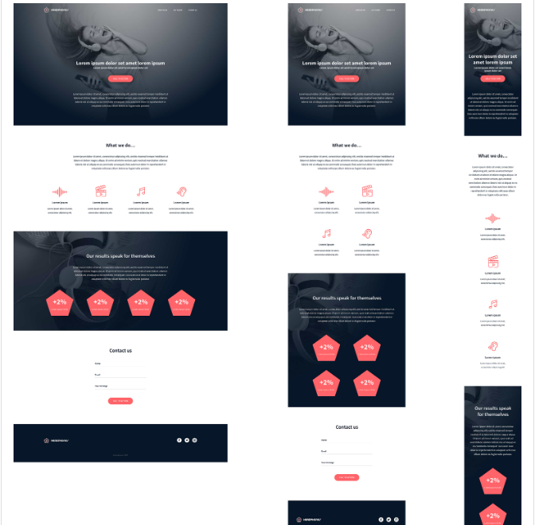

# Holberton School - Headphone Company

### version one.

#### By **Ngala Mike**

## Description

This is an ALX Project that involves implementing a design from scratch.

Here's the expected final result:

## Setup/Installation Requirements

- Open your terminal 
- Initialize git on your terminal.
- git clone <https://github.com/ngala21/alx_html_css.git>
- Open the 'headphones' folder.
- Open preferred html file from your preferred internet browser
- Wait for the magic 

## Tools
- Figma
- VS Code
- Google Chrome

## Technologies Used

- HTML
- CSS
- Accessibility
- Responsive design

  ## Support and contact details

  In case of any issues please do contact ngalamike21@gmail.com

  Copyright (c) 2024 **Ngala21**
